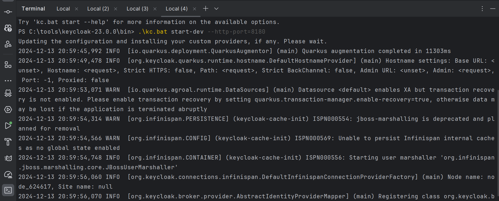
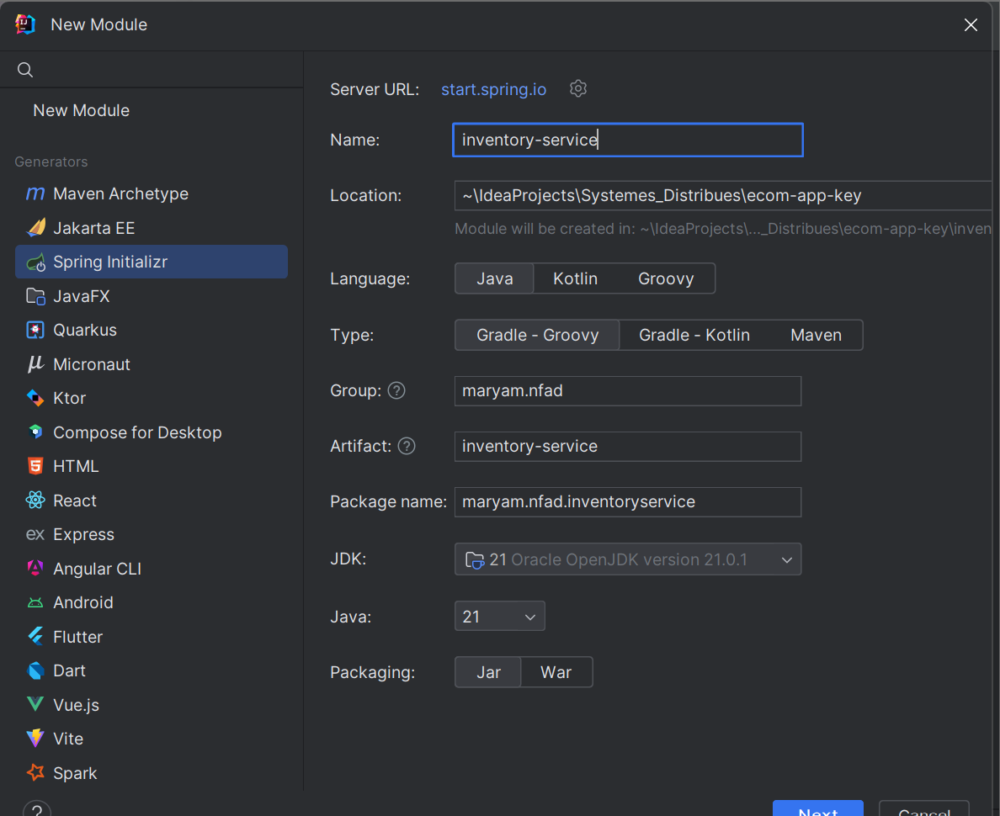

# TP :  Sécurisation d'une Architecture Microservices avec Keycloak


**Ce projet démontre la mise en place d'une architecture microservices sécurisée utilisant Spring Boot, Angular et Keycloak. L'application est composée de plusieurs services distincts :**

ecom-app-angular : Frontend Angular
inventory-service : Service de gestion des produits
order-service : Service de gestion des commandes


---

## Technologies utilisées


- Spring Boot
- Axon Framework
- Spring Data JPA
- Base de données H2
- Spring Web
- Lombok
- Spring Doc OpenAPI UI

## Étapes du TP
### 1. Configuration de Keycloak
1. Télécharger et installer Keycloak 19
2. Démarrer le serveur
3. Créer un compte Admin
4. Créer une Realm
5. Configurer un client
6. Créer des utilisateurs et des rôles
7. Configurer les tokens





## 2. Architecture du projet
Le projet est organisé selon les modules principaux :

Côté Backend :
Inventory Service (Gestion des produits)
Order Service (Gestion des commandes)

Côté Frontend :
Application Angular avec sécurité intégrée


### 3. Initialisation du projet

Créer un projet Spring Boot avec les dépendances suivantes :
- **Spring Boot**
- **Keycloak 19**
- **Spring Security**
- **Spring OAuth2 Resource Server**
- **Spring Web**
- **Spring Data JPA**
- **H2 Database**
- **Lombok**
- **Keycloak.js**
- **JUnit 5**

  
  
  
  


## 4. Structure du projet

Le projet est organisé selon l'architecture suivante :


## 5. Implémentation de la sécurité
Exemple de Configuration Spring Security :

```java
@Configuration
@EnableWebSecurity
@EnableMethodSecurity(prePostEnabled = true)
public class SecurityConfig {
    private JwtAuthConverter jwtAuthConverter;

    public SecurityConfig(JwtAuthConverter jwtAuthConverter) {
        this.jwtAuthConverter = jwtAuthConverter;
    }

    @Bean
    public SecurityFilterChain securityFilterChain(HttpSecurity httpSecurity) throws Exception {
        return httpSecurity
                .cors(Customizer.withDefaults())
                .sessionManagement(sm->sm.sessionCreationPolicy(SessionCreationPolicy.STATELESS))
                .csrf(csrf->csrf.disable())
                .headers(h->h.frameOptions(fo->fo.disable()))
                .authorizeHttpRequests(ar->ar.requestMatchers("/h2-console/**", "/swagger-ui.html","/v3/**","swagger-ui/**").permitAll())
                //.authorizeHttpRequests(ar->ar.requestMatchers("/api/products/** ").hasAuthority("ADMIN"))
                .authorizeHttpRequests(ar->ar.anyRequest().authenticated())
                .oauth2ResourceServer(o2->o2.jwt(jwt->jwt.jwtAuthenticationConverter(jwtAuthConverter)))
                .build();
    }
    @Bean
    CorsConfigurationSource corsConfigurationSource() {
        CorsConfiguration configuration = new CorsConfiguration();
        configuration.setAllowedOrigins(Arrays.asList("*"));
        configuration.setAllowedMethods(Arrays.asList("*"));
        configuration.setAllowedHeaders(Arrays.asList("*"));
        configuration.setExposedHeaders(Arrays.asList("*"));
        UrlBasedCorsConfigurationSource source = new UrlBasedCorsConfigurationSource();
        source.registerCorsConfiguration("/**", configuration);
        return source;
    }
}


```

```java

@Component
public class JwtAuthConverter implements Converter<Jwt, AbstractAuthenticationToken> {
    private final JwtGrantedAuthoritiesConverter jwtGrantedAuthoritiesConverter=new JwtGrantedAuthoritiesConverter();


    @Override
    public AbstractAuthenticationToken convert(Jwt jwt) {
        Collection<GrantedAuthority> authorities = Stream.concat(
                jwtGrantedAuthoritiesConverter.convert(jwt).stream(),
                extractResourceRoles(jwt).stream()
        ).collect(Collectors.toSet());
        return new JwtAuthenticationToken(jwt, authorities,jwt.getClaim("preferred_username"));
    }

    private Collection<GrantedAuthority> extractResourceRoles(Jwt jwt) {
        Map<String , Object> realmAccess;
        Collection<String> roles;
        if(jwt.getClaim("realm_access")==null){
            return Set.of();
        }
        realmAccess = jwt.getClaim("realm_access");
        roles = (Collection<String>) realmAccess.get("roles");
        return roles.stream().map(role->new SimpleGrantedAuthority(role)).collect(Collectors.toSet());
    }

}
```

Exemple de Configuration Angular :

```
import { Injectable } from '@angular/core';
import {
  ActivatedRouteSnapshot,
  Router,
  RouterStateSnapshot
} from '@angular/router';
import { KeycloakAuthGuard, KeycloakService } from 'keycloak-angular';

@Injectable({
  providedIn: 'root'
})
export class AuthGuard extends KeycloakAuthGuard {
  constructor(
    protected override readonly router: Router,
    protected readonly keycloak: KeycloakService
  ) {
    super(router, keycloak);
  }

  public async isAccessAllowed(
    route: ActivatedRouteSnapshot,
    state: RouterStateSnapshot
  ) {
    // Force the user to log in if currently unauthenticated.
    if (!this.authenticated) {
      await this.keycloak.login({
        redirectUri: window.location.origin + state.url
      });
    }

    // Get the roles required from the route.
    const requiredRoles = route.data['roles'];

    // Allow the user to proceed if no additional roles are required to access the route.
    if (!Array.isArray(requiredRoles) || requiredRoles.length === 0) {
      return true;
    }

    // Allow the user to proceed if all the required roles are present.
    return requiredRoles.every((role) => this.roles.includes(role));
  }
}

```
## 5. Configuration des services
application.properties (Inventory Service) :
```
spring.application.name=inv-service
server.port=8087
spring.datasource.url=jdbc:h2:mem:products-db
spring.h2.console.enabled=true

spring.cloud.config.enabled=false
spring.cloud.discovery.enabled=false

spring.security.oauth2.resourceserver.jwt.issuer-uri=http://localhost:8180/realms/ecom-app-realm
spring.security.oauth2.resourceserver.jwt.jwk-set-uri=http://localhost:8180/realms/ecom-app-realm/protocol/openid-connect/certs
```

## Data Base :


## Test :


